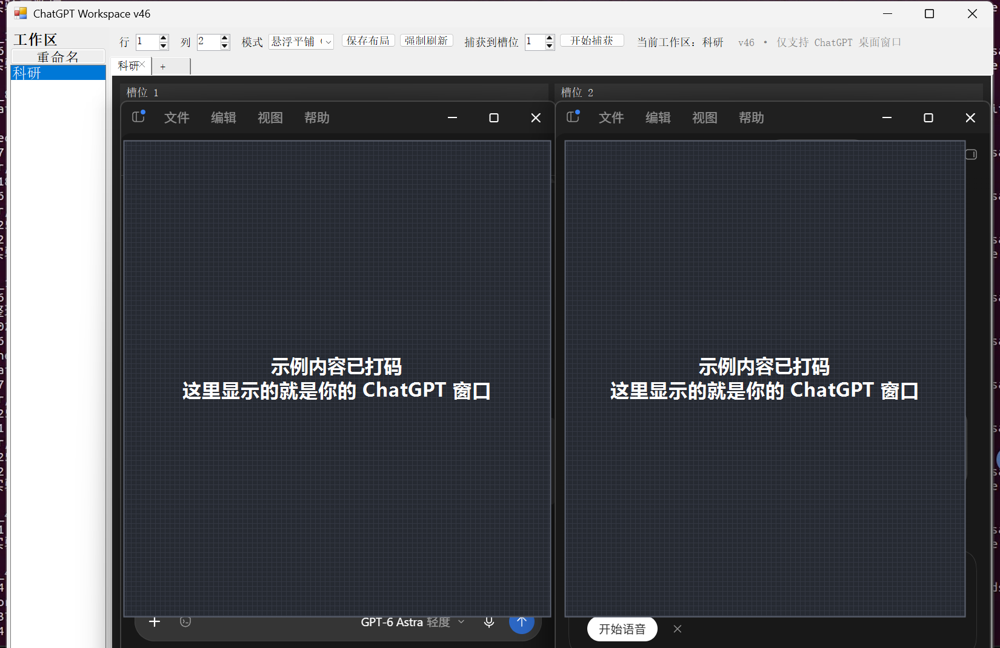
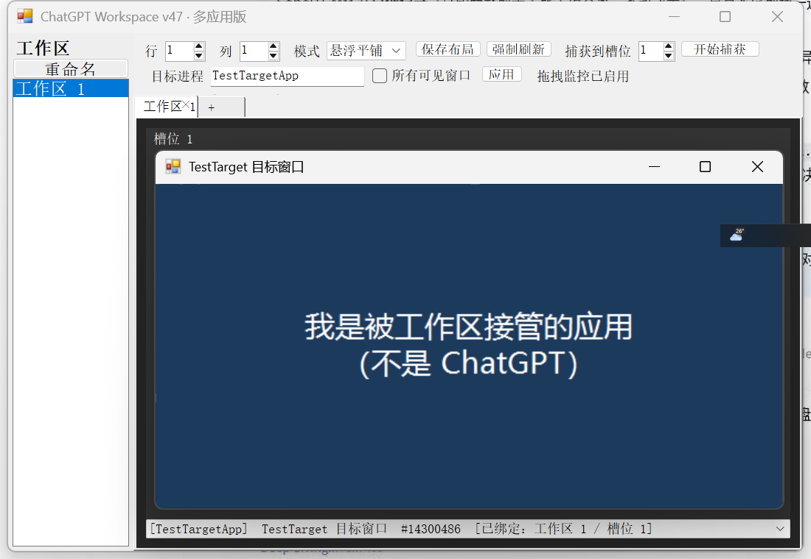

# ChatGPT Workspace

把**多个应用窗口**收进同一个窗口、按格子排好的小工具。
支持 ChatGPT、Claude、Cursor、VS Code、终端、浏览器……任何有窗口的程序（v47 起可自定义目标进程）。
给同时开着好几个聊天/编码窗口干活的人用：不用再来回切窗口找"那个在等我回话的"。

*↑ 1×2 布局，左边工作区侧栏，右边每格一个真实的 ChatGPT 窗口（示例对话内容已打码）*

---

## 快速开始

1. 打开要接管的程序（ChatGPT / Claude / Cursor / VS Code / 终端 / 浏览器…）
2. 双击 **`ChatGPTWorkspace.exe`**
3. 设好「行 / 列」，程序会**自动**把发现的窗口填进空格子；满意后点「保存布局」

> 不需要安装 .NET / Python / 任何运行库，**不需要管理员权限**。Windows 10 / 11 64 位。

## 特性

- **多工作区**：顶部标签页 + 左侧列表，一键切换，切走时窗口自动让位
- **多应用**（v47）：工具栏「目标进程」里可增删要接管的进程名，或勾「所有可见窗口」接管全部；系统壳窗口会自动跳过
- **全屏 / 无边框 / 置顶程序**（v48）：无标题窗口、默认全屏的相机客户端、Always-on-top 窗口都能接管；退出时连"最小化/最大化状态"一起精确还原
- **不闪烁、不硬碰**（v49）：只在被宿主压住时才提 z 序（不再每秒置顶，视频窗口不再闪）
- **镜像模式**（v50）：强制全屏 / GPU 渲染的程序（相机客户端、播放器等）用 DWM 缩略图把画面缩放进槽位，**鼠标点击会转发给原程序**；自动按「悬浮 → 嵌入 → 镜像」逐级升级
- **自动认领**：启动时把发现的窗口按顺序填进空槽位，窗口标题变化也不会丢绑定
- **三种绑定方式**：槽位下拉框 / 拖动窗口到格子上 / `F8` 捕获（F8 被占用时自动改用 `Ctrl+Alt+F8`）
- **退出即还原**：关闭工具时，所有窗口回到被摆进格子之前的位置和尺寸
- **不侵入**：不写注册表、不装服务、不开机自启，删目录即卸载

## 三种摆放模式

| 模式 | 说明 |
|---|---|
| **悬浮平铺**（默认，推荐） | 窗口保持独立、被精确摆到格子上方，画面原生渲染，内容一定正常 |
| 嵌入子窗口（实验） | 用 `SetParent` 真嵌成子窗口。ChatGPT 是 Electron/Chromium，画面走 DirectComposition，**实测永远黑屏**，仅作研究 |
| 自动（实验） | 先试嵌入，失败才转悬浮。因黑屏无法自动检测，不推荐 |

## 文档

- **`使用说明.html`** —— 图文版说明书（单文件，图片已内嵌，双击用浏览器打开即可）
- **`使用说明.pdf`** —— 同一份说明书的 PDF 版

*↑ v47：槽位里可以是任意应用；下拉框按 `[进程名] 窗口标题` 显示*

## 注意事项

- 关闭时请用窗口 `×` 或 `Alt+F4`，**不要用任务管理器强杀** —— 强杀不会执行还原动作，ChatGPT 窗口可能留下无边框状态（重启 ChatGPT 即可恢复）。
- 配置文件 `chatgpt-workspace.ini` 和日志 `ChatGPTWorkspace.log` 生成在 exe 旁边；挪目录时请一起带走。

## 版本

当前 **v50**：多应用 + 全屏/无边框/置顶/最小化状态处理 + 消除闪烁 + **镜像模式（DWM 缩略图，可点击）**，并保留 v46–v49 的全部修复。
